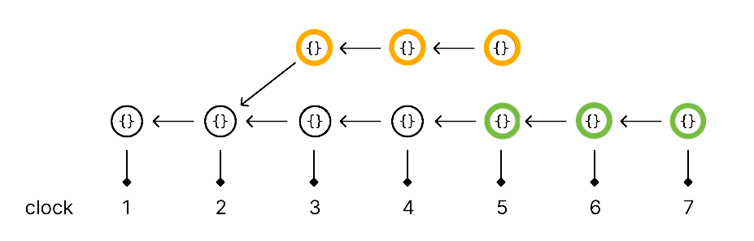

<HeroRow text="Write distributed TypeScript applications" :image="{ light: '/graphic_jellyfish_dark.png', dark: '/graphic_jellyfish.png' }">
  <HeroAction theme="brand big" text="Guide" href="/1-introduction" />
  <HeroAction theme="brand big" text="Blog" href="/blog" />
  <HeroAction theme="alt big" text="API Docs" href="/readme-core" />
</HeroRow>

Canvas is a runtime for writing distributed TypeScript applications,
where each application is verifiable, interoperable, and syncs
server-to-server over the open web.

A Canvas application is a state machine that defines a database, and a
set of actions:

```ts
export const models = {
	messages: {
		id: "primary",
		text: "string"
	}
}

export const actions = {
	createMessage: (db, { text }, { address, txid }) => {
		db.set("messages", { id: txid, text })
	}
}
```

```
$ canvas run contract.js
Running on localhost:8000...
```

The database is translated to SQLite, IndexedDB, or Postgres
depending on where the application is running.

Each application and its database timestamps its actions on a
Git-like distributed log. Users' actions are applied to the
local copy of the application, and application instances sync
with each other, server-to-server or server-to-browser. [^1]

[^1]: For example, if we both ran the same open-source application
backed by Canvas on different servers, our applications would sync
with each other. Applications in the browser can also sync to a server,
but many other systems already support that.

We also handle reconciliation, to guarantee that actions
execute exactly the same, whenever or wherever they're received. [^2]

[^2]: We do this by time-shifting actions, so they always read
from the database as if they were running at the time they were created.
This uses an "eventually-consistent retrieval" implementation inside
the database.

```ts
import { useCanvas } from "@canvas-js/hooks"

const models = {} // same as above...
const actions = {} // ...

const { app } = useCanvas({
	topic: "demo.canvas.xyz",
	contract: { models, actions },
	bootstrapList: ["https://canvas-demo-node.fly.io"],
})
```

This will sync the application at `canvas-demo-node.fly.io`
into your browser.

Unlike blockchain-based distributed applications, Canvas applications have
somewhat different properties:

* **No crypto required**. For building apps, not launching tokens.
* **TypeScript-based**: Use millions of packages from NPM & Github.
* **Realtime multiplayer**: Actions sync in real time. If you're
  familiar with Figma or Google Docs' multiplayer system,
  Canvas gives you similar capabilities.
* **Unlimited throughput**. Applications run as fast as your server,
  without waiting for consensus.
* **Define your own conflict resolution**. When multiple users
  update the database concurrently, by default, recent writes overwrite
  earlier ones. You can also define custom conflict resolution
  strategies (e.g. CRDTs, surface conflicts to the user).

If you are writing a document-oriented, directory-like, or social
application, Canvas basically allows you to write a distributed
application in the same way that you'd write a traditional one.

## Merging History

Each Canvas application executes over a distributed log. By default,
anyone can add branches to any point in the log, and different nodes
could append to different branches of the log at any time:



If application operators go out of sync (e.g. someone starts a new node
that only syncs part of the history), new interactions could be added on
top of an earlier state of the application.

To resolve this, we have a few options:

* Some applications are fine without strong protections against
  backdated actions. We expose an `indexed_at` field that can be
  used to detect actions sent with out-of-sync timestamps.
* Some applications may wish to run with a coordinator node, where
  other nodes only peer with the coordinator. This lets you
  provide stronger guarantees against backdated actions, while
  preserving verifiability and permissionless interoperability.
* Other applications may wish to use a timestamping service or
  data availability network to finalize actions. We're in
  touch with teams to make this possible.

## About Canvas

Canvas is built by a team that built Web3 tools used by top protocols
and 100k+ users, developed peer-to-peer infrastructure at Protocol
Labs, and worked at companies like AngelList, Notion, and Medium in
the early days.

We've been working on Canvas since mid-2022, and deployed early
versions of the system in production environments.

We are building the infrastructure that we wish existed, to make
distributed programming and peer-to-peer systems accessible to
ordinary programmers.

<br/>

<FeatureRow title="Components" detail="">
  <FeatureCard title="@canvas-js/okra" details="A Prolly tree written in Zig, that enables fast peer-to-peer sync for action history logs." link="https://github.com/canvasxyz/okra" linkText="Github" secondaryLink="https://docs.canvas.xyz/blog/2023-05-04-merklizing-the-key-value-store.html" secondaryLinkText="Blog Post"/>
  <FeatureCard title="@canvas-js/gossiplog" details="A self-authenticating distributed log for multi-writer applications." link="https://github.com/canvasxyz/canvas/tree/main/packages/gossiplog" linkText="Github" secondaryLinkText="Presentation" secondaryLink="https://www.youtube.com/watch?v=X8nAdx1G-Cs"/>
  <FeatureCard title="@canvas-js/modeldb" details="A cross-platform relational database wrapper for IndexedDB, SQLite, and Postgres." link="https://github.com/canvasxyz/canvas/tree/main/packages/modeldb" linkText="Github"/>
  <FeatureCard title="Sign in with Ethereum" details="Log in with an Ethereum wallet. Also supports Cosmos, Solana, and Polkadot." linkText="Demo" link="https://canvas-chat.pages.dev/"/>
  <FeatureCard title="Sign in with Bluesky" details="Log in with your decentralized identity from the Bluesky PLC network." linkText="Demo" link="https://canvas-chat.pages.dev/"/>
  <FeatureCard title="Sign in with OpenID" details="Log in trustlessly with Google, Apple, or other SSO providers." soon="In development"/>
</FeatureRow>

<HomepageFooter />
