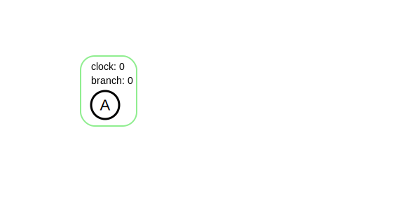
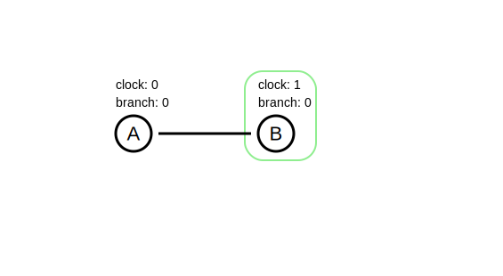
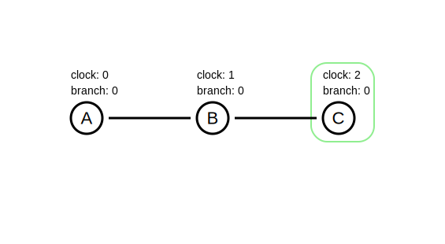
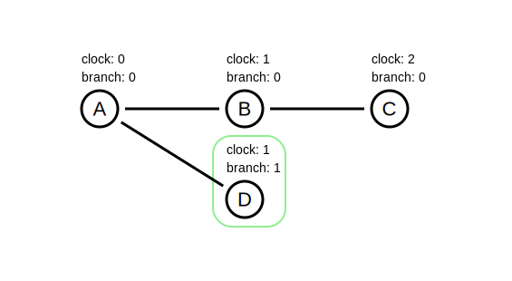
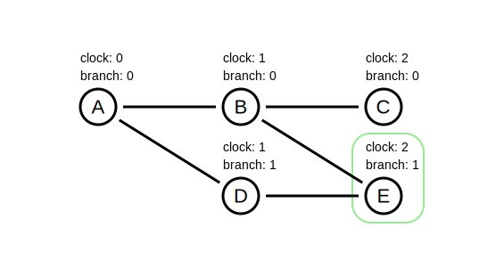
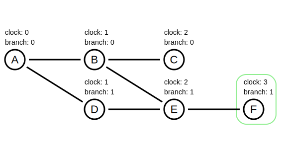
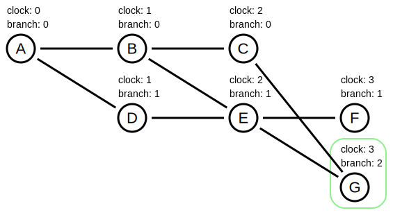

# Branches

In Canvas, the message log is an acyclic directed graph. Messages can have multiple "parents". This results in messages being partially ordered, i.e. some messages are children/ancestors of each other and some occur concurrently. Inside our implementation of Runtime and GossipLog we keep track of the "branch number" of each message and effect. Note that unlike the clock number, the branch number is local to each peer. The same message (i.e. same contents, same transitive set of parents) may have a different branch number on different peers.

This document will explain how branch numbers are determined and then explain how they are used within Canvas. Attention will be given to the data model and algorithms used.

## Relevant tables:

- `$messages` - this table stores the id, signature, message contents (the `message` column), hash, branch and clock information about each message that the peer sees.
- `$effects` - in the case where a message is an action, it may make changes to the data in ModelDB. We call these changes "effects". This table stores the key (which consists of the model name and the key to be updated) and value that were set, as well as the branch number and clock of the message that produced the effect.
- `$branch_merges` - this table stores the points where branches split off from and/or join each other. TODO: we aren't actually using this - delete?

## How branch numbers are calculated

When Canvas receives a new message (either by syncing with another peer or generating a message locally, e.g. when the user performs an action or creates a session), it is assigned a "branch number". These are positive integers, starting at zero.

The algorithm is as follows:

1. If the message has no parents, then allocate a new branch number and return it.
2. If the parent with the highest branch value is the latest message on its branch (i.e. the peer has not seen any of its "children" yet), then return this parent's branch number.
3. Otherwise, allocate a new branch number.

To allocate a new branch number, choose the current maximum branch number across all messages and add `1`.

### Example

1. Add a message A. This message has no parents, so allocate a new branch `0`.

2. Add a message B with one parent A. This message has one parent who has no other children, so give it branch `0`.

3. Add a message C with parent B. This message also has one parent (B) who has no other children, so give it branch `0`.

4. Add a message D with parent A. A already has a child (B) so allocate a new branch `1`.

5. Add a message E with parents B and D. D has a higher branch number (`1`) than B (`0`). D does not have any other children, so E's branch number is `1`.

6. Add a message F with one parent E. E does not have any other children, so F's branch number is `1`.

7. Add a message G with parents C and E. Out of the two parents, E has the highest branch number. E already has a child, so allocate a new branch `2`.

Some observations:

- For a given peer, there is at most one message with a particular combination of clock and branch values.
- The branch number depends on the order in which messages have been seen.

<!--

branch merges

- what do the columns mean
- where/how do we use this table?

show a graph
and the corresponding values of the effects/branch merges tables

how is model state calculated?
with and without versions

visualise how versions work
tables? -->
